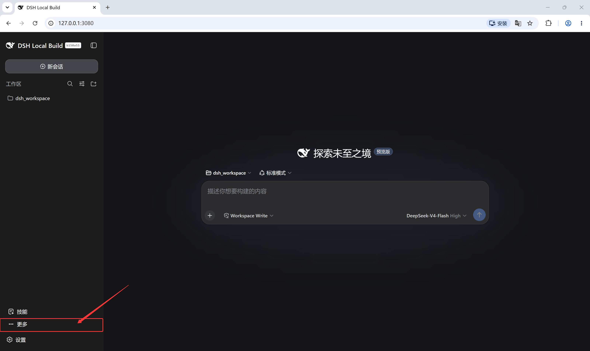
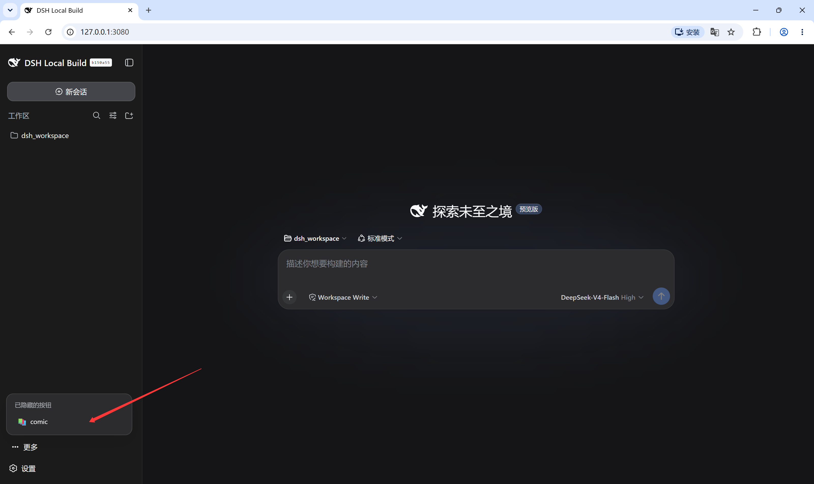
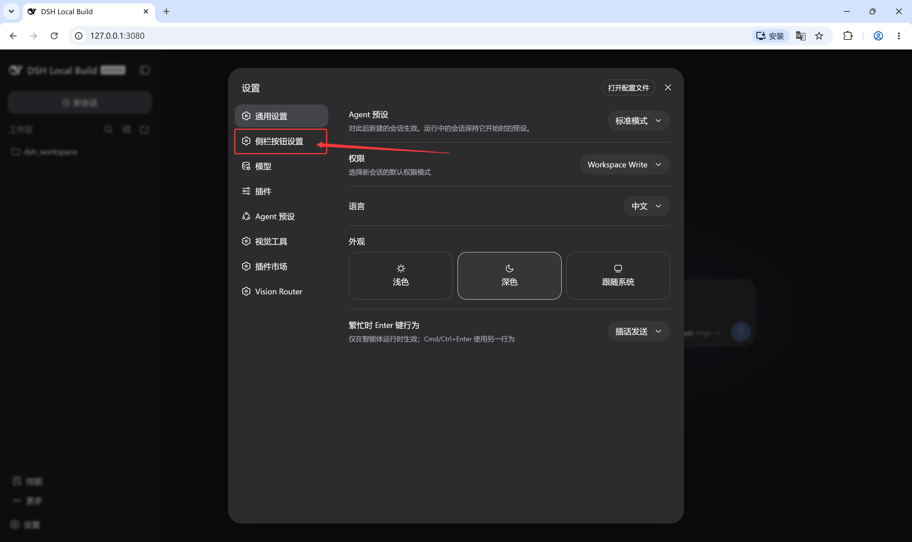
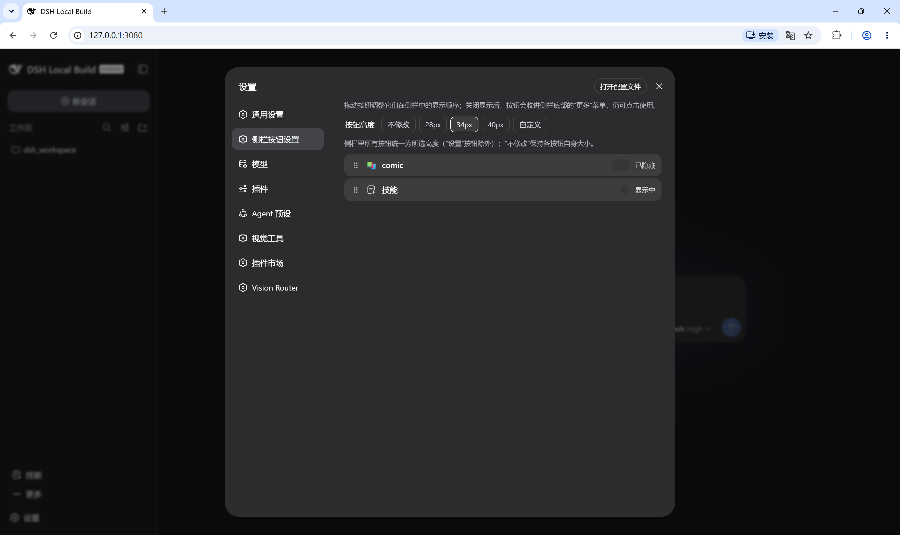

# dsh-sidebar-buttons

English · [简体中文](./README.zh.md)

A DeepSeek Harness plugin. Manages the buttons at the bottom of the left sidebar: reorder them, control each one with three display modes, and give them all the same height. Client-side only, nothing in the DSH core is touched, uninstalling restores the original sidebar.

## Features

- New "Sidebar Buttons" page in Settings lists every button registered in the sidebar foot; drag rows to change the order, the sidebar updates immediately
- Each button has three display modes:
  - **Show**: pinned in the sidebar
  - **Fold into More**: moved into a "More" button above Settings (only shown while at least one button is folded), where it stays usable
  - **Hide**: absent from the sidebar and the More menu alike — recoverable only from the settings page
- Buttons from different plugins come in different sizes; pick one height for all of them, keep each button's original size, or enter a custom value

## Screenshots









## Install

```bash
dsh plugin --profile web add github:lywusichen/dsh-sidebar-buttons
```

Restart DSH, then open Settings → Sidebar Buttons.

## Build

```bash
npm install   # esbuild
npm run build # generates lib/client.js
```

## License

MIT
